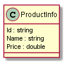
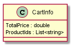

# Online shopping, ระบบซื้อของออนไลน์

## API
|Verb|Path|Remark|
|--|--|--|
|???|???|???|

## Features
### Product management
**Acceptance criteria**
1. ผู้ใช้สามารถดูรายการสินค้าทั้งหมดในระบบได้
1. ผู้ใช้สามารถเพิ่มสินค้าใหม่ได้
1. ผู้ใช้สามารถลบสินค้าจากรหัสสินค้าได้
1. ผู้ใช้สามารถแก้ไขข้อมูลสินค้าได้
1. กำหนดให้ Api ของ module นี้จะต้องอยู่ในกลุ่ม `ProductController` เท่านั้น
1. กำหนดให้ **ข้อมูลสินค้า** จะต้องใช้ model จาก `Models/ProductInfo.cs` เท่านั้น ตามรูปด้านล่าง
#### Diagrams

### Cart management
**Acceptance criteria**
1. ผู้ใช้สามารถดูข้อมูลตะกร้าสินค้าได้ และจะต้องบอกราคาสินค้ารวมทั้งหมดด้วย
1. ผู้ใช้สามารถเพิ่มสินค้าลงตะกร้าได้
1. ผู้ใช้สามารถลบสินค้าออกจากตะกร้าได้ โดยอ้างจากรหัสสินค้า
1. กำหนดให้ Api ของ module นี้จะต้องอยู่ในกลุ่ม `CartController` เท่านั้น
1. กำหนดให้ **ข้อมูลตะกร้าสินค้า** จะต้องใช้ model จาก `Models/CartInfo.cs` เท่านั้น ตามรูปด้านล่าง
#### Diagrams
